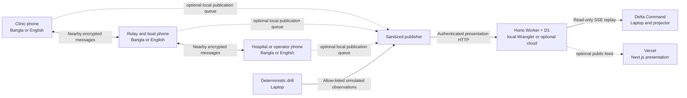
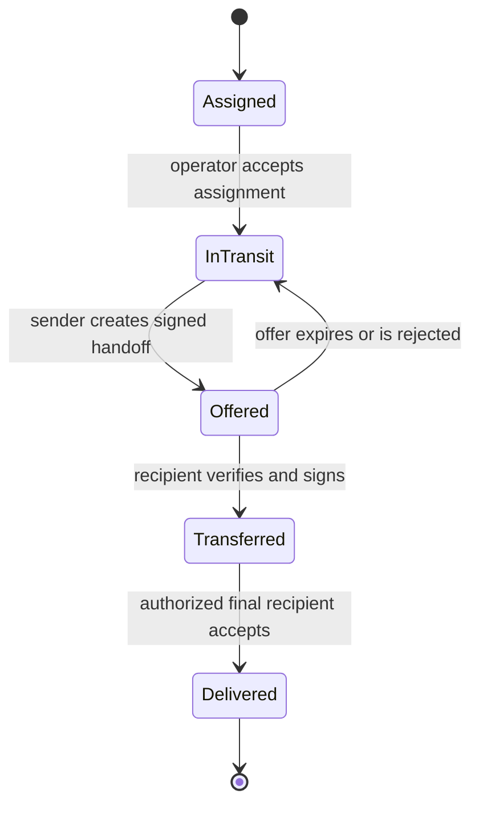

# Technical architecture

## Architecture goals

- Complete core field work without commercial internet.
- Keep each phone useful when every laptop is unavailable.
- Use one shared event model across all eight modules.
- Make interrupted transfer, retries, duplicates, and conflict visible.
- Keep language out of protocol state so Bangla and English devices converge identically.
- Separate real device operations from simulated environment and vehicle events.
- Produce evidence that can be inspected during a demonstration.

## System context



Every observer link can fail without stopping field transactions. The drill and Android request publishers are implemented; an Android-created test request has reached local Hono/D1 and the browser. This is emulator/HTTP evidence, not physical three-phone independence. Vercel and D1 never sit between field phones.

## Components

### Field application

Responsibilities:

- identity provisioning and unlock;
- local SQLite data and operation log;
- request, cargo, route, triage, and handoff workflows;
- nearby neighbor discovery and message transfer;
- signatures, encryption, hash verification, and replay cache;
- conflict handling and projection rebuild;
- on-device route search and risk inference;
- Bangla and English rendering.

The field app is a native Android application written in Kotlin and Jetpack Compose. ViewModels expose immutable screen state through StateFlow. Repositories coordinate Room, Proto DataStore, cryptography, routing, and the nearby transport. Hilt supplies replaceable production, simulation, and test implementations.

Nearby Connections runs behind a `PeerTransport` interface. An Android foreground service owns an active relay session. WorkManager handles deferrable cleanup and retry work but does not run the continuous mesh. The first supported device baseline is Android 8 or newer, subject to confirmation against the phones used at the fair.

Signed credential revocations use the same offline path without exposing their payload to relay nodes. The importing phone records a non-simulated `credential_revoked` domain event and creates a separately encrypted P0 envelope for each known peer, including the revoked target's last provisioned key. The destination persists the envelope before acknowledgement. Deferred maintenance then decrypts only locally addressed records, verifies the envelope digest and administrator signature, applies the exact credential once, records an application disposition, and fans the signed event onward while excluding the immediate sender. WorkManager is deliberately limited to this bounded application/cleanup work; it never replaces the live foreground relay.

### Node and simulation service

Responsibilities:

- gRPC service definitions and generated Go implementations;
- deterministic scenario events;
- load and fault simulation;
- legacy observer comparison harness (disabled by default);
- route and CRDT reference implementations for cross-checking mobile results;
- test evidence export.

The service is a demo and engineering aid. Field phones cannot depend on it for identity checks, routing, triage, handoff, or local state.

### Delta Command

Responsibilities:

- map, route, inventory, SLA, node, risk, conflict, and custody views;
- measured performance and evidence display;
- Bangla and English projector layouts;
- observer-only event ingestion;
- scenario replay.

The Next.js dashboard holds a disposable projection. Rebuilding it from signed events must yield the same visible mission. The fair runs it locally; the Vercel copy is an optional public presentation.

### Hono headquarters observer

Responsibilities:

- authenticate source-bound publishers and accept only allow-listed presentation metadata;
- retain an ordered public-demo history in Cloudflare D1;
- reject unknown, malformed, oversized or out-of-range presentation fields;
- remain optional and visibly non-authoritative.

The archive cannot issue commands, authenticate field operators, route cargo, accept custody, or decrypt any mesh content.

### Disaster Control

Responsibilities:

- issue deterministic simulated environment and failure events;
- pause, step, replay, and reset a scenario;
- display seed, actor, and simulation status;
- avoid direct database edits.

## Event-driven domain

Every accepted action becomes an immutable domain event. Each device stores events and builds read models from them.

Example event families:

- `IdentityProvisioned`
- `RoleGranted`
- `ReliefRequestCreated`
- `CargoReserved`
- `RoutePlanned`
- `EdgeStatusChanged`
- `EdgeRiskPredicted`
- `RendezvousPlanned`
- `VehicleStateChanged`
- `SlaBreachPredicted`
- `PreemptionProposed`
- `PreemptionConfirmed`
- `CustodyTransferProposed`
- `CustodyTransferAccepted`
- `DeliveryVerified`
- `ConflictRaised`
- `ConflictResolved`

Events use stable codes. Localized text is produced at display time.

## Message envelope

The conceptual envelope contains:

```proto
message Envelope {
  string message_id = 1;
  uint32 schema_version = 2;
  string sender_node_id = 3;
  string recipient_node_id = 4;
  bytes vector_clock = 5;
  int64 created_at_unix_ms = 6;
  int64 expires_at_unix_ms = 7;
  uint32 hop_count = 8;
  uint32 hop_limit = 9;
  PriorityClass priority = 10;
  bytes encrypted_payload = 11;
  bytes payload_sha256 = 12;
  bytes sender_signature = 13;
  bool simulated = 14;
  string scenario_seed = 15;
}
```

The exact schema will live under `packages/proto`. This example is explanatory and should not be treated as generated code.

## Transport model

### IP-capable links

Use gRPC with Protocol Buffers between nodes where a direct local IP connection supports HTTP/2 reliably.

### Nearby-radio links

Use the selected Android nearby transport to move framed Protocol Buffer envelopes. Store-and-forward, acknowledgement, TTL, hop limit, deduplication, and recipient encryption live in the application layer.

Nearby comparison digits require an explicit operator decision, then both accepted endpoints issue independent 32-byte nonce challenges. Each response carries the administrator-signed provisioning credential and a device RSA-PSS signature over the complete challenge, claimed node, credential, and signing time. A proof must match the locally pending challenge, Nearby endpoint name, credential node and signing key, validity window, and pinned administrator key. The challenge is consumed once. Until both phones independently complete this exchange, the endpoint remains `Authenticating` and cannot send an envelope or acknowledgement into the field workflow.

One APK supports four allow-listed fair profiles: N1 coordinator, N4 clinic, N6 hospital, and RLY-01 relay. The selected profile is stored in local Protobuf DataStore and determines the Keystore aliases, enrollment request, Nearby endpoint name, ingress node, and acknowledgement signer. Changing it stops the foreground relay first. A profile selection grants no authority by itself: the installed administrator-signed credential must exactly match the selected node, identity, role, encryption-key ID, and signing-key ID. The policy is enforced in both Compose and the ViewModel action boundary. Free-form node IDs are deliberately not accepted from the UI.

This path must not be described as gRPC unless it actually carries a valid gRPC transport. All mesh payloads remain Protobuf.

Payload encryption is hybrid: each message receives a random AES-256-GCM content key, and that key is wrapped with the final recipient's provisioned RSA-2048 public key using OAEP with SHA-256. Android private encryption and signing keys remain non-exportable in Android Keystore. The Protobuf envelope carries the recipient key ID, nonce, associated-data hash, wrapped content key, and explicit algorithm identifiers so relays can route bytes without opening the domain payload.

### Offline QR capture

Provisioning, recipient credentials, and delivery handoffs use one lifecycle-bound CameraX preview with the bundled ML Kit barcode model. No camera frame or decoded QR is written to disk by the scanner. A small purpose gate rejects QR text from the wrong workflow before forwarding the exact decoded value to the existing credential or proof verifier; prefixes are routing hints, never security authority. Signature, trust, expiry, delivery, payload-hash, and nonce checks remain mandatory after scanning. Manual paste stays available for accessibility and camera failure, and denial of camera permission does not block the rest of the offline field application.

For a non-simulated handoff, the QR's sender key is accepted only when it matches an installed administrator-signed sender credential that is inside its validity window and not revoked. Missing, expired, revoked, or mismatched trust is rejected before nonce claim or custody mutation. The single-phone rehearsal may use its local sender key only when the vehicle and flow are visibly marked simulated; this exception does not exist for operational events.

### Dashboard observation

The active observer uses Hono on Cloudflare Workers and ordered D1 storage. An enrolled Android publisher converts locally authored domain events to allow-listed presentation JSON and publishes with a source-bound bearer token. Hono assigns sequences, rejects duplicate-ID content changes, and provides generation-aware cursor replay through SSE. JSON exists only outside the mesh at this presentation boundary. No envelopes, ciphertext, credentials, signatures, arbitrary summaries or medical payload details are accepted. Collector authentication must not be described as end-to-end field-event signature verification.

The Next.js headquarters dashboard is a disposable projection. Its root provider survives navigation across seven App Router workspaces; observer and exercise state are kept separate. When events arrive it rebuilds route, risk, rendezvous and vehicle state in sequence order. The visible recent log is bounded without discarding accumulated projections. A simulated observation remains labelled even over a live stream. Closing the SSE connection or laptop cannot block phone Room, routing, triage, queueing or custody. See docs/OBSERVER.md for configuration and publication limits.

The Vercel deployment is a presentation surface, not the fair control plane. Locally, Wrangler runs Hono and persisted D1 on the laptop without cloud access. A hosted Hono instance is optional; its publisher credentials belong in Worker secrets, never the browser. Losing Vercel, Workers, D1, the laptop or internet does not stop field workflows. The old Go observer is available only with --legacy-observer for comparison. Local test evidence does not certify a production deployment.

The projector map does not fetch public raster tiles at runtime. MapLibre GL reads the reviewed `public/maps/sylhet.pmtiles` archive over the laptop's local HTTP server; its SHA-256 is checked by the local verification gate. The vector archive supplies real OpenStreetMap-derived geography and attribution. The route renderer resolves graph edge IDs against a build copy of `packages/scenario/sylhet_route_geometry.json`; the local gate requires this copy to be byte-identical because the Vercel project root contains only `apps/command`. Road edges are committed multi-point OpenStreetMap routes exported through OSRM, water edges follow connected OpenStreetMap waterway centerlines from the pinned basemap, and only simulated airways use direct dashed lines. Risk, active-route, node, rendezvous, and vehicle facts remain in a separate mission GeoJSON source so rehearsed state cannot be mistaken for map observations.

The Android field map follows the same provenance boundary. `apps/command/scripts/export-android-map.mjs` deterministically extracts a RAM-bounded zoom-10 geographic view from that reviewed archive into a 4.4 MB GeoJSON asset. The asset records the source-archive hash, extraction bounds, and attribution, and has its own checked SHA-256. The Android asset set also includes the canonical route geometry directly from `packages/scenario`; the app verifies its SHA-256 before rendering. A lifecycle-aware Compose adapter gives MapLibre Native two local in-memory sources: OSM-derived basemap geography and mission state built from the same route polylines used by the projector. Runtime connectivity is disabled, the style contains no glyph, sprite, or network URLs, and the previous Compose route diagram appears only if asset verification or native rendering fails.

## Local storage

Suggested tables:

| Table | Purpose |
|---|---|
| `events` | Immutable verified domain events |
| `event_signatures` | Signer, signature, key version, and verification state |
| `inbox` | Received envelopes awaiting verification or application |
| `outbox` | Envelopes awaiting one or more neighbors |
| `seen_messages` | Deduplication IDs and expiry |
| `vector_clocks` | Per-replica counters |
| `conflicts` | Unsafe concurrent changes awaiting review |
| `nonces` | Accepted handoff nonces and expiry |
| `identities` | Public identity, role, status, and encrypted private-key reference |
| `map_nodes` | Offline geographic and facility nodes |
| `map_edges` | Directed transport edges and current state |
| `model_versions` | On-device model metadata and threshold |
| `projections` | Rebuildable request, route, inventory, and custody views |

Database migrations must preserve stored event bytes so signature verification remains reproducible.

## CRDT and conflict policy

One CRDT should not be forced onto every field.

| Data | Merge behavior |
|---|---|
| Audit and receipt IDs | Grow-only set |
| Message-seen IDs | Expiring grow-only set |
| Inventory increments and decrements | Per-replica counter or signed stock operations |
| Tags and observers | Observed-remove set |
| Request description | Last-writer result may be shown, but concurrent changes remain inspectable |
| Priority, destination, medical quantity | Human review when concurrent and mission-active |
| Custody | Signed state transition, never automatic last-write-wins |
| Edge prediction | Keep by model version and observation time |
| Confirmed edge closure | Authorized event overrides prediction for routing state |

Each projection stores a convergence hash. Devices that have the same accepted event set and policy version must produce the same hash.

## Routing engine

The graph is directed and supports road, waterway, and airway edges. Route cost may include:

```text
effective_cost = base_time
               + confirmed_delay
               + prediction_risk_penalty
               + handoff_penalty
               + policy_penalty
```

Confirmed closure removes an edge. Predicted risk adds a documented penalty. Vehicle constraints filter edges before search. Deterministic tie-breaking keeps devices consistent.

## Triage engine

Inputs:

- cargo priority and SLA;
- current time and ETA;
- 30 percent slowdown ETA;
- vehicle capacity;
- route and waypoint availability;
- existing custody and assignment state.

Outputs:

- no action;
- SLA warning;
- preemption proposal;
- safe drop-waypoint proposal;
- route recomputation request.

The engine proposes. An authorized person confirms changes that affect cargo custody or active assignments.

## Route-risk model

The smallest defensible classifier wins over a large opaque model. The pipeline must compare the selected model with a simple baseline.

On-device input:

- rainfall rate;
- elevation;
- soil saturation proxy;
- optional recent trend if the final dataset supports it.

On-device output:

- impassability probability within two hours;
- threshold result;
- model version;
- feature values;
- simulated-input flag.

## Handoff state machine



Every transition checks role, current custodian, delivery ID, nonce, credential state, payload hash, and signature.

## Main data flow

1. A clinic creates a P0 request in Bangla.
2. The app converts localized form choices into language-neutral domain codes.
3. The app signs and stores `ReliefRequestCreated` before attempting transfer.
4. The outbox encrypts the payload for its authorized destination and creates an envelope.
5. Nearby neighbors return an RSA-PSS-signed durable receipt. The sender verifies its exact message ID, node, status, reason, timestamp, credential lifetime, and provisioned signing key before advancing the outbox.
6. Each relay verifies envelope integrity, stores it, increments the hop count, and forwards later.
7. The recipient decrypts, verifies, deduplicates, appends the event, and rebuilds projections.
8. Routing and triage react to the new event locally.
9. Observer events update the dashboard when available.
10. A signed QR handoff produces linked custody events that follow the same sync path.

## Failure handling

- Commit local events before network transfer.
- Treat a verified signed acknowledgement as durable receipt, not final domain acceptance. Unsigned, stale, altered, unknown-key, expired-key, revoked-key, or wrong-node acknowledgements remain retryable failures.
- Retry with bounded exponential backoff and urgency-aware scheduling.
- Preserve failed envelopes in a dead-letter queue with a visible reason.
- Rebuild projections after policy or application upgrade.
- Reject unknown schema versions safely and retain their bytes for later readers.
- Keep user-visible errors actionable and localized.

## Planned repository structure

```text
apps/
  field-android/
    app/                    Compose screens, navigation, and app wiring
    core/
      domain/               Language-neutral events, policies, and algorithms
      data/                 Room, Proto DataStore, repositories, and sync
      network/              Nearby, gRPC, Protobuf, and foreground relay
      security/             Tink, Android Keystore, identity, and QR verification
      ui/                   Material theme, reusable components, and localization
      testing/              Fakes, fixtures, property tests, and device helpers
    feature/
      identity/
      requests/
      sync/
      mesh/
      routing/
      pod/
      triage/
      prediction/
      fleet/
  command/
    src/
      features/
      map/
      scenario/
      localization/
services/
  node/
    cmd/
      node/
      chaos/
      loadtest/
    internal/
      grpc/
      simulation/
      evidence/
packages/
  proto/
  localization/
  scenario/
models/
  route-decay/
docs/
scripts/
artifacts/
```

## Open technical decisions

- CRDT library versus small audited custom types
- gRPC-Web or alternate observer transport
- Exact Android minimum version after the physical-device inventory
- Nearby Connections compatibility and permission behavior on each target phone
- Offline Sylhet tile source, attribution, zoom range, and package size
- Android Keystore behavior and secure-hardware availability on target phones
- Model runtime size and memory budget

Record decisions and evidence in [DECISIONS.md](DECISIONS.md).

## September 5 remediation checkpoint

The native Missions workspace reads accepted requests and projections from Room.
Local request creation writes that projection atomically with its encrypted outbox.
Signed mission edits and coordinator resolutions use independent recipient encryption
and the inbox application path. Missing dependencies remain retryable; retry ordering
cannot permanently starve new creation events. Transport receipts are not acceptance.

Operational custody uses persisted requests, current projections and provisioned
participant credentials. The production dependency graph no longer uses same-phone
demo aliases. M8 retains an explicitly simulated boat/drone exercise. The initial
operational custodian is the request's origin node, not its requester. The normal
clinic N4 → coordinator N1 → hospital N6 workflow freezes its reader set at creation.
Edits, resolutions and independently signed receipts fan out to those readers.
Receipt versions pin a canonical set of immutable mission-event IDs; missing
revisions remain retryable. Later edits cannot rewrite an earlier custody chain.
Before the first handoff, a coordinator can assign a two-to-eight-node custody path
among frozen mission readers; intermediate nodes must have driver or coordinator
credentials. Subsequent independently signed handoffs follow that path and preserve
the first receipt's cargo/version commitment. Hash links, rather than disconnected
phone timestamps, determine receipt order. Reassigning the path after custody begins
is deliberately blocked; recovery requiring a different path is not implemented yet.

A concurrent edit crossing a receipt is retained with a bilingual reconciliation
warning. A coordinator can explicitly retain the signed cargo/path, with a reason
and the exact reviewed revision IDs. New changes arriving while the dialog is open
invalidate that confirmation. Reconciliation never modifies an existing receipt or
claims that extra supplies were delivered; changed needs require a follow-up request.
These records are signed Protobuf domain events and fan out to the frozen readers.

Room schema 9 archives verified public credentials for historical receipt checks.
An older credential replay cannot replace a newer active credential. Revocations
target the exact archived credential, so revoking an old key does not revoke its
replacement. A historical handoff must still satisfy authority at its signed time.
No private keys are copied into the archive. Physical phone/key replacement and
post-handoff lost-phone recovery are separate acceptance work.

Optional headquarters publication uses the operation log as durable work and
`observer_publications` as its per-destination receipt ledger (Room schema 8).
WorkManager sends allowlisted summaries to Hono using a separately provisioned,
source-bound token encrypted under an Android Keystore AES key. HTTPS is required
in release; debug permits explicit emulator/loopback HTTP addresses. Publication
failure cannot roll back field work. The Android allowlist currently covers request,
route and SLA summaries; cargo details, free text, keys, signatures and mesh payloads
are excluded. Requests, edits and resolutions schedule publication, though unsupported
event kinds are filtered, not exposed. Missions also offers an explicit record-plan
action that computes a fresh route/SLA snapshot from accepted state, commits it
without network access and schedules publication. Packaged travel times are always
labelled simulated, even for a non-simulated request. It neither assigns a vehicle
nor invents road conditions. The periodic worker also drains eligible local events.

Go's engineering workload is registered only as `ReducedMeshLoadHarnessService`,
with separate request/response types and literal loopback binding. It does not
implement the secured `NodeMeshService` contract. Its performance reports must
remain labelled reduced-workload measurements.
